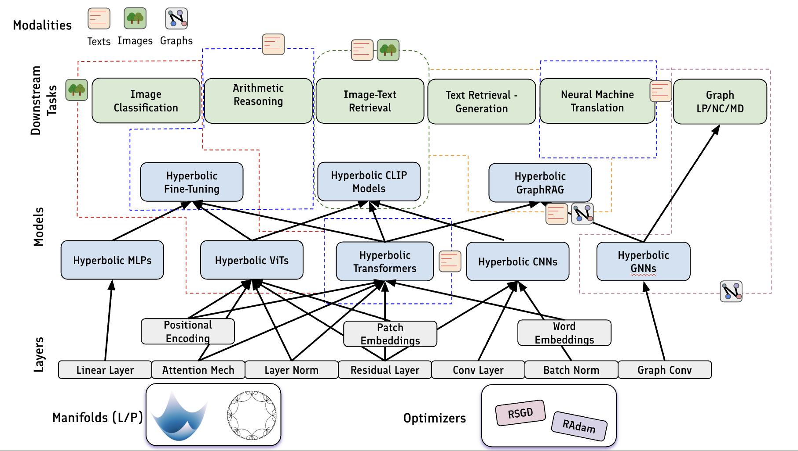

# HyperCore

**HyperCore** is a framework built upon PyTorch to easily write and train hyperbolic foundation models for a wide range of applications in diverse modalities. [PAPER LINK](https://arxiv.org/abs/2504.08912)

We provide the core modules and functionalities that makes this process simple for users of all levels of backgrounds in differential geometry. These include methods and algorithms for hyperbolic neural networks and foundation models, optimization techiniques, and manifold operations. These come together to enable intuitive constructions of hyperbolic foundation models architectures and pipelines, e.g. [hyperbolic Transformer encoder](example_usage/Hyperbolic_Transformers/lorentz_transformer.py), [hyperbolic ViT](example_usage/Hyperbolic_Transformers/vision_transformer.py), [hyperbolic fine-tuning](example_usage/Fine-Tuning/fine_tuning_example.py), [hyperbolic GraphRAG](example_usage/Hyperbolic_GraphRAG/graphRAG_example.py) and much more (see our paper and tutorials below!). 

- [Framework Highlights](#framework-highlights)
- [Installation](#installation)
- [Quick Start: Build Hyperbolic Foundation Models](#quick-start-build-hyperbolic-foundation-models)
- [Framework Overview](#framework-overview)
- [Implemented Modules and Details](#implemented-modules-and-details)


## Framework Highlights
HyperCore is accessible to experts in hyperbolic deep learning, the more general AI audience, and first-time user of deep learning toolkits alike. Here are some reasons you might want to use HyperCore for building, training, or using foundation models in hyperbolic space!

- **Flexible and Intuitive Foundation Model Support:** HyperCore it is capable of doing much more than reproducing existing models—its components can be effortlessly combined to construct novel hyperbolic foundation models that have yet to be proposed. See [example usage](example_usage) for extensive examples of how to build hyperbolic foundation models with HyperCore!
- **Easy-to-use Modules:** As the API is designed almost identically to Euclidean counterparts, users only need a high-level understanding of foundation models to build hyperbolic ones using HyperCore. All it takes is a few lines to create hyperbolic foundation models components like fully hyperbolic Transformer encoder blocks (see [here](#quick-start-build-hyperbolic-foundation-models) for a quick start guide)!
- **Comprehensive Modules and Model Support:** Unlike anything out there, hyperCore provides a comprehensive and extensive list of essential hyperbolic modules for building a wide range of hyperbolic foundation models for learning across diverse modalities. 

## Installation
For now, the dependencies for HyperCore can be installed via 
```
pip install -r requirements.txt
```
Installation via pip directly is ***coming soon...***

## Quick Start: Build Hyperbolic Foundation Models
In this quick start guide, we highlight the ease of creating and training a hyperbolic foudnation model model with HyperCore.
### Creating Your Own Hyperbolic Transformer Encoder Block
In the first glimpse of HyperCore, we build the encoder block of a hyperbolic Transformer, using hyperbolic-tailored modules such as [LorentzMultiheadAttention](hypercore/nn/attention/lorentz_former_conv.py) for multiple attention and [LResNet](hypercore/nn/conv/conv_util_layers.py) for residual connection. 

```python
import torch
import torch.nn as nn
import hypercore.nn as hnn

class LTransformerBlock(nn.Module):
    def __init__(self, manifold, d_model: int, n_head: int):
        super().__init__()
        dim_per_head = d_model // n_head
        out_dim = d_model - 1
        mlp_dim = d_model * 4 - 1
        self.manifold = manifold
        self.attn = hnn.LorentzMultiheadAttention(manifold, dim_per_head, dim_per_head, n_head, attention_type='full', trans_heads_concat=True)
        self.ln_1 = hnn.LorentzLayerNorm(manifold, out_dim)
        self.mlp = nn.Sequential(
            hnn.LorentzLinear(manifold, d_model, mlp_dim),
            hnn.LorentzActivation(manifold, activation=nn.GELU()),
            hnn.LorentzLinear(manifold, mlp_dim+1, out_dim),
        )
        self.ln_2 = hnn.LorentzLayerNorm(manifold, out_dim)
        self.res1 = hnn.LResNet(manifold, use_scale=True)
        self.res2 = hnn.LResNet(manifold, use_scale=True)

    def forward(self, x, attn_mask=None):
        # x: embedded features matrix of shape [batch, seq_len, dim_per_head * num_heads]
        lx = self.ln_1(x)
        ax = self.attn(lx, lx, mask=attn_mask)
        x = self.res1(x, ax)
        x = self.res2(x, self.mlp(self.ln_2(x)))
        return x
```

For more examples of how to employ hyperbolic foundation model counponents in downstream tasks, please see [example usages](example_usage)

### Training a Hyperbolic Vision Transformer
Let's take a quick look at how to easily train a pre-built hyperbolic foundation model with HyperCore, by looking at an example of training a Lorentzian vision Transformer (LViT, see [our paper](https://arxiv.org/abs/2504.08912) for more details) on classifying images in the CIFAR10 dataset. 

In particular, since hyperbolic parameters require special update rules (see [here](https://arxiv.org/abs/1810.00760) for more details), HyperCore automatically sets up the optimizers to update Euclidean and hyperbolic parameters. Additionally, we can use separate optimization schemes for parameters on different manifolds. 

Functionalities like these make it seemless to transition from training Euclidean foundation models to hyperbolic ones.

```python
from torchvision import datasets, transforms
import torch
from hypercore.manifolds import Lorentz
from hypercore.optimizers import Optimizer, LR_Scheduler
from hypercore.models import LViT
import numpy as np

# prepare the dataset as usual
train_transform=transforms.Compose([
            transforms.RandomCrop(32, padding=4),
            transforms.RandomHorizontalFlip(),
            transforms.ToTensor(),
            transforms.Normalize((0.5074, 0.4867, 0.4411), (0.267, 0.256, 0.276)),
        ])

test_transform=transforms.Compose([
            transforms.ToTensor(),
            transforms.Normalize((0.5074, 0.4867, 0.4411), (0.267, 0.256, 0.276)),
        ])

train_set = datasets.CIFAR10('hypercore/data', train=True, download=True, transform=train_transform)
test_set = datasets.CIFAR10('hypercore/data', train=False, download=True, transform=test_transform)

train_loader = torch.utils.data.DataLoader(train_set, batch_size=64, num_workers=8, pin_memory=True, shuffle=True)
test_loader = torch.utils.data.DataLoader(test_set, batch_size=64, num_workers=8, pin_memory=True, shuffle=False)
device = torch.device('cuda:0' if torch.cuda.is_available() else 'cpu')

# Initiate the hyperbolic manifold with curvature -1.0
manifold = Lorentz(1.0)
model = LViT(manifold_in=manifold, manifold_hidden=manifold, manifold_out=manifold).to(device)

# Initiate the optimizers. Note that we have separate optimizers for Euclidean and hyperbolic parameters
optimizer = Optimizer(model, euc_optimizer_type='adamW', euc_lr=1e-4, euc_weight_decay=1e-2, hyp_optimizer_type='radam', hyp_lr=1e-4, 
    hyp_weight_decay=1e-4, stabilize=1)

# Initiate the learning rate scheduler for each optimizers
lr_scheduler = LR_Scheduler(optimizer_euc=optimizer.optimizer[0], euc_lr_reduce_freq=30, euc_gamma=0.1, hyp_gamma=0.1, hyp_lr_reduce_freq=30, optimizer_hyp=optimizer.optimizer[1])

criterion = torch.nn.CrossEntropyLoss()
for epoch in range(0, 300):
        model.train()
        losses = []
        acc1 = []
        acc5 = []

        for i, (x, y) in tqdm(enumerate(train_loader)):
            x = x.to(device)
            y = y.to(device)
            logits = model(x)
            loss = criterion(logits, y)

            optimizer.zero_grad()
            loss.backward()
            optimizer.step()

# Function to calcuate top-k classification accuracy 
@torch.no_grad()
def accuracy(output, target, topk=(1,)):
    maxk = max(topk)
    batch_size = target.size(0)

    _, pred = output.topk(maxk, 1, True, True)
    pred = pred.t()
    correct = pred.eq(target.view(1, -1).expand_as(pred))

    res = []
    for k in topk:
        correct_k = correct[:k].reshape(-1).float().sum(0, keepdim=True)
        res.append(correct_k.mul_(100.0 / batch_size))

model.eval()
acc1 = []
acc5 = []

for i, (x, y) in enumerate(test_loader):
    x = x.to(device)
    y = y.to(device)
    logits = model(x)
    top1, top5 = accuracy(logits, y, topk=(1, 5))
    acc1.append(top1.item(), x.shape[0])
    acc5.append(top5.item(), x.shape[0])

acc1_test = np.mean(acc1)
acc5_test = np.mean(acc5)
print("Results: Acc@1={:.4f}, Acc@5={:.4f}".format(acc1_test, acc5_test))
```

## Framework Overview
HyperCore is a framework that supports constructing, developing, and evaluating hyperbolic foundation models from multiple levels, from fundamental training schemes to modules with hyperbolic layers to the models and downstream tasks themselves. 

- **Hyperbolic manifold and optimizers:** 
- **Hyperbolic Modules and Layers**
- **Hyperbolic Neural Networks**
- **Hyperbolic Foundation Models**
- **Downstream Tasks Support**



## Implemented Modules and Details
